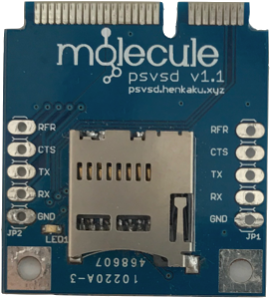

## psvsd

psvsd is a hardware mod for OLED PS Vita that replaces the vestigal 3G modem with a USB microSD card adapter. When used with a [hacked Vita](https://henkaku.xyz/) and the [usbmc](https://github.com/yifanlu/usbmc) plugin, you can replace the expensive PS Vita memory card with any microSD card. More information can be found on [Indiegogo](http://indiegogo.com/projects/ps-vita-3g-to-microsd-card-adapter/x/16550489).

## Building

psvsd is an open source hardware that is free for anyone to use, reproduce, modify, or sale under the [CC-BY-4.0](https://github.com/yifanlu/psvsd/blob/master/LICENSE.txt) license.

## Purchase

Currently there are no commerical production of psvsd. If you would like to sell psvsd, please file a [Github issue](https://github.com/yifanlu/psvsd/issues) and we will link to it here.

## Installing

### Hardware

Requirements

* PCH-110x 3G OLED model Vita running firmware 3.60 or lower. If you have a Wifi only OLED model or Vita that is on a higher firmware, consider buying a replacement motherboard online for ~$30.
* microSD card formatted to either FAT32 or exFAT on your computer. If given the option, choose to use the MBR partition scheme. There is no capacity limit.
* Phillips #00 screwdriver
* (Optional) J00 or T4 screwdriver (different units have different screws for the 3G modem cards)
* (Optional) Spudger (will aid in opening the device, you can use your fingernails but you have to be careful)

Steps

1. Follow the disassembly tutorial on [iFixit](https://www.ifixit.com/Teardown/PlayStation+Vita+Teardown/7872) down to step 9. If you are replacing the motherboard as well, follow down to step 20. A general piece of advice is that you should be careful removing the battery connector. You should pull upwards away from the surface of the motherboard to remove the connector **not** downwards. That connector is very fragile and easily breakable.
2. Remove the 3G modem card. Be **very** careful unscrewing the modem. The screws can be very tight and you can easily cam them out. If you are using a replacement motherboard, you can purchase screws with M1.6x4mm size.
3. Insert the psvsd card at a 45° angle and push down to lock it in place. Use the screws to secure it in place.
4. Place the microSD card into the psvsd module.
5. Reassemble the Vita back together.

### Software

1. If you have not done so already, [upgrade your Vita to firmware 3.60](https://henkaku.xyz/usage/#upgrading-to-360).
2. Install [HENkaku Ensō](https://enso.henkaku.xyz).
3. Install the [usbmc](https://github.com/yifanlu/usbmc/releases/latest) vpk.
4. Open the usbmc installer follow the on-screen prompt. Once it is done your Vita will reboot.

At this point, you can use your psvsd as extra storage mounted at `uma0:`. Continue reading if you wish to use it as a memory card.

1. Launch the usbmc installer again.
2. Follow the on-screen prompt to install USB as memory card.
3. You are given the option to either copy VitaShell/molecularShell to the microSD or _all_ content to the microSD. The first option is if you wish to start fresh or restore from a CMA backup. The second option is if you want to transfer all data from the memory card to the microSD. Any file that exists on both the memory card and microSD will be overwritten with the copy on the memory card.
4. Once the copying is done, your Vita will shut down.
5. Remove the original memory card and power up the Vita.

If you put in a memory card again, the Vita will always use the memory card before looking at the USB storage. Keep in mind that you need a memory card to uninstall psvsd (directions on the [usbmc](https://github.com/yifanlu/usbmc) page).
